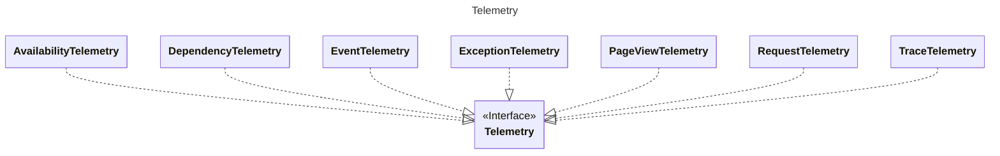

# Azure Monitor Telemetry 

A tiny and very effective library to work via components aka Application Insights.

# Why Consider This Library
Standard Application Insights library has the following disadvantages. 

1.  Is considered as deprecated.
2.  Is not designed to work in certain scenarios like Power Platform plugins.
3.  Has problems with authentication.
4.  Slow.

# Class Diagram

